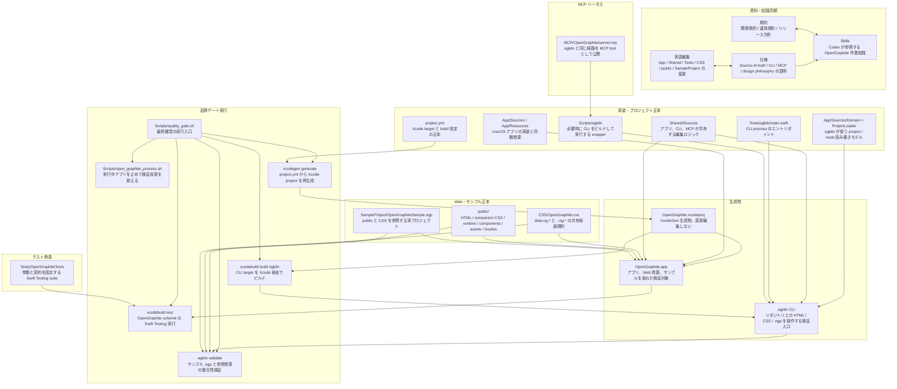

# Codex グローバルカスタムプロンプト

- 返信は特段の指示がない限りすべて自然な日本語で行うこと。
- 技術用語やコマンド名は必要に応じて原語（英語）を併記してよい。
- ユーザーが別言語での回答を明示的に求めた場合のみ、その指示に従う。
- ログやコード片など引用部分は原文を尊重しつつ、必要があれば簡潔な日本語の補足を加える。
- リポジトリ直下の `README.md` を参照し、プロジェクトの規約について記述があった場合は厳守する。

## OpenGraphite 作業ルール

- `project.yml` を XcodeGen の正本として扱い、`OpenGraphite.xcodeproj` は生成物として直接編集しない。
- Swift コードを追加・変更する場合は `Docs/rules/DocumentCommentStandards.md` に従い、主要な型と関数へ `///` ドキュメントコメントを付与する。
- テストを追加・変更する場合は `Docs/rules/TestingStandards.md` に従い、Swift Testing の `@Suite` / `@Test` と Given/When/Then コメントを用いる。
- TODO 文書を追加・更新する場合は `Docs/operations/TODO/GOVERNANCE.md` と `Docs/operations/TODO/TEMPLATE.md` に従い、残タスクだけを直列化して管理する。
- 作業指示、利用者向け説明、エージェント向け知識、仕様、開発規約、運用手順、リリース手順、自動化定義、検証入口は、実装と同じリポジトリ資源として扱う。
- 挙動、正本モデル、ディレクトリ責務、検証ハーネス、リリース手順を変える場合は、関連する実装、テスト、資料、skill、workflow を同じ変更単位で更新する。
- 1つの挙動変更に必要な資源を、理由なく別々のコミットへ分断しない。
- コード、設定、ドキュメント生成に関わる変更を完了する前に、品質ゲート `./Scripts/quality_gate.sh` を必ず完走させる。
- 品質ゲートが失敗した状態で作業を完了してはならない。外部要因で実行できない場合のみ、理由と未確認範囲を明記してユーザーへ報告する。

## ディレクトリ責務

```text
.
├── App/                         # macOS SwiftUI アプリ本体
│   ├── Sources/
│   │   ├── Domain/              # プロジェクト、ノード、参照 ID などのドメイン
│   │   ├── Editor/              # 編集状態、HTML 同期、Web canvas 連携
│   │   ├── Infrastructure/      # プロジェクト作成、読み込み、ダイアログなどの入出力
│   │   └── Presentation/        # SwiftUI の画面、Inspector、Sidebar、Window chrome
│   └── Resources/               # Info.plist、アイコンなどのアプリ資源
├── Shared/
│   └── Sources/                 # アプリ、ogkiln、MCP が共有する Agent Interface と HTML/CSS 操作
├── Tools/
│   └── ogkiln/                  # ogkiln CLI のエントリポイント
├── Scripts/                     # build、test、quality gate、署名、release、ogkiln wrapper
│   └── release/                 # GitHub Release と release policy 関連の補助 script
├── script/                      # ローカル app build/run/debug/log 確認用の補助入口
├── MCP/
│   └── OpenGraphite/            # Scripts/ogkiln を呼び出す MCP server と README
├── CSS/                         # 配布対象の OpenGraphite.css と共有描画規約
├── public/                      # OpenGraphite で編集される Web 正本
│   ├── _components/             # component master、component CSS、component asset
│   ├── assets/                  # 公開ページで使う画像などの静的 asset
│   ├── locales/                 # i18n 用 locale JSON
│   └── *.html / *.css           # ページ HTML と同名 companion CSS
├── SampleProject/               # public/ と CSS/ を参照するサンプル .ogp
├── Tests/
│   └── OpenGraphiteTests/       # Swift Testing の単体・統合寄りテスト
├── Docs/                        # 設計、仕様、ルール、TODO 運用、リリース手順、調査記録
│   ├── specs/                   # source-of-truth、CLI、MCP、設計思想などの仕様
│   ├── rules/                   # ドキュメントコメントとテスト記述の規約
│   ├── operations/              # TODO governance と運用 TODO
│   ├── release/                 # DMG、notarization、dev/main release 手順
│   └── investigations/          # 調査記録
├── .agents/
│   └── skills/                  # Codex が参照する OpenGraphite 固有 skill
├── .github/
│   └── workflows/               # GitHub Actions の CI / release 検証
├── Configs/                     # Xcode build 用 xcconfig
├── OpenGraphite.xcodeproj/      # project.yml から生成される成果物。直接編集しない
├── .build/                      # ローカル CLI build 出力
├── build/                       # Xcode / release 検証のローカル build 出力
├── dist/                        # 配布物や export の出力先
└── .temp/                       # 一時検証、スクリーンショット、作業用出力
```

## ハーネス対応

このリポジトリのハーネスは `Scripts/quality_gate.sh` を実行入口にし、実装、仕様、規約、skill、アプリ、CLI、MCP、サンプルプロジェクト、Web 資源を同じ正本モデルで同期・検証する。


